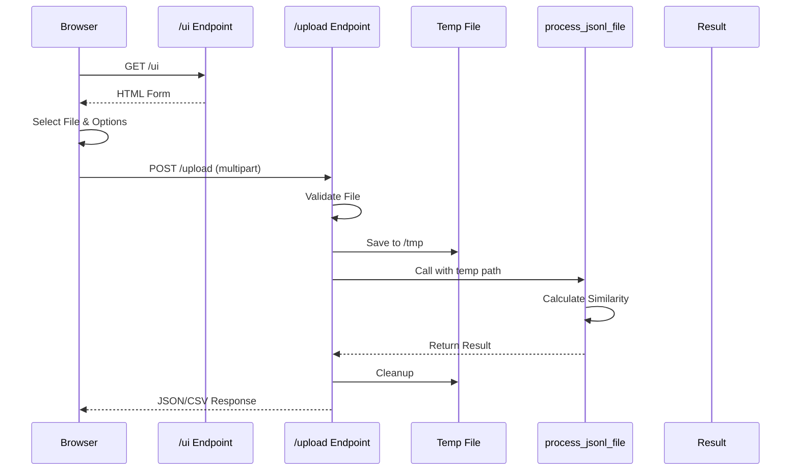
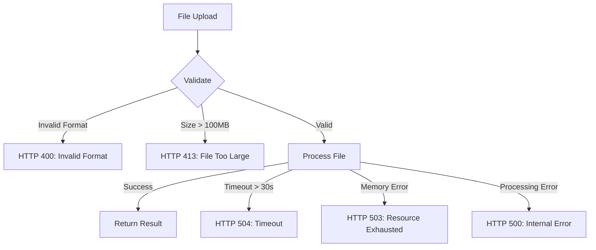

# Technical Design Document

## 概要

この機能は、JSON Compare APIにWebブラウザベースのファイルアップロード機能を追加し、技術的知識が限定的なユーザーにもアクセシブルなインターフェースを提供します。既存のコマンドラインツールの機能をWeb UIから利用可能にし、JSONLファイルのアップロード、処理、結果のダウンロードを一貫したワークフローで実現します。

システムは既存のapi.pyを拡張し、新しいエンドポイントを追加することで実装されます。処理は同期的に実行され、既存のprocess_jsonl_file関数を再利用することで、CLI版と同じ品質の結果を保証します。

### ゴール
- HTMLフォーム経由でJSONLファイルをアップロード可能にする
- シンプルで直感的なWeb UIを提供する
- JSON/CSV形式での結果ダウンロードを実現する
- 既存の類似度計算機能を完全に活用する
- 処理時間の可視化とエラーフィードバックを提供する

### 非ゴール
- 非同期処理やジョブキューの実装
- 複数ファイルの同時処理
- ユーザー認証・認可機能
- リアルタイムプログレス表示（WebSocket）
- 結果の永続化・履歴管理

## アーキテクチャ

### 既存アーキテクチャ分析
現在のシステムは以下のアーキテクチャパターンに基づいています：
- **レイヤードアーキテクチャ**: CLI層、ビジネスロジック層、データ処理層の明確な分離
- **モジュラー設計**: 各機能が独立したモジュールとして実装
- **関数型アプローチ**: 副作用を最小化し、純粋関数として処理を実装
- **同期処理モデル**: すべての処理が同期的に実行される

### ハイレベルアーキテクチャ

```mermaid
graph TB
    subgraph "Web Browser"
        UI[HTML Form UI]
    end

    subgraph "FastAPI Server"
        API[api.py - Extended]
        UP[Upload Endpoints]
        ST[Static HTML Serving]
    end

    subgraph "Core Processing"
        MAIN[__main__.py]
        SIM[similarity.py]
        EMB[embedding.py]
    end

    subgraph "Temporary Storage"
        TMP[/tmp files]
    end

    UI -->|multipart/form-data| UP
    UP -->|save file| TMP
    UP -->|process| MAIN
    MAIN --> SIM
    SIM --> EMB
    UP -->|result| UI
    API --> ST
    ST -->|serve| UI
```

**アーキテクチャ統合**:
- 既存パターンの保持: レイヤードアーキテクチャ、同期処理モデル
- 新規コンポーネントの根拠: Web UIアクセシビリティの要件に対応
- 技術スタック整合性: FastAPIの既存利用を拡張
- ステアリング準拠: structure.mdの原則に従い、api.py内に新エンドポイントを追加

### 技術アライメント

既存の技術スタックとの整合性：
- **FastAPI**: 既存のAPIフレームワークを活用し、新規エンドポイントを追加
- **python-multipart**: ファイルアップロード処理用の新規依存として追加
- **Jinja2**: HTMLテンプレート処理用（FastAPIの標準機能）
- **既存処理関数**: __main__.pyのprocess_jsonl_fileを変更なしで再利用

**主要な設計決定**:

**決定1: api.py内での実装統合**
- **コンテキスト**: 当初は新規モジュール作成を検討したが、ユーザーからapi.py修正許可を取得
- **代替案**: 1) 新規upload.pyモジュール作成、2) 別プロセスとして実装、3) api.py内に統合
- **選択アプローチ**: api.py内に新規エンドポイントを追加
- **根拠**: コードの集約性向上、FastAPIアプリケーションインスタンスの共有、メンテナンス性の向上
- **トレードオフ**: api.pyのサイズ増加 vs 統一されたAPI管理

**決定2: 同期処理モデルの採用**
- **コンテキスト**: ファイルアップロードから結果取得までのワークフロー設計
- **代替案**: 1) 非同期ジョブキュー、2) WebSocketリアルタイム、3) 同期処理
- **選択アプローチ**: HTTPリクエスト内での同期処理完了
- **根拠**: 実装の単純性、デバッグの容易性、既存コードとの親和性
- **トレードオフ**: 長時間処理でのタイムアウトリスク vs システム複雑性の低減

## システムフロー

### ファイルアップロードと処理フロー



### エラーハンドリングフロー



## コンポーネントとインターフェース

### Web層

#### ファイルアップロードエンドポイント

**責任と境界**
- **主要責任**: multipart/form-dataとして送信されたファイルの受信と処理
- **ドメイン境界**: Web APIレイヤー
- **データ所有権**: アップロードされたファイルの一時管理
- **トランザクション境界**: 単一HTTPリクエスト内での完全処理

**依存関係**
- **インバウンド**: Webブラウザクライアント
- **アウトバウンド**: __main__.process_jsonl_file関数
- **外部**: python-multipart（ファイル解析）、tempfile（一時ファイル管理）

**API契約**

| Method | Endpoint | Request | Response | Errors |
|--------|----------|---------|----------|--------|
| POST | /upload | multipart/form-data: file(UploadFile), type(str), gpu(bool) | JSON/CSV Result | 400, 413, 500, 503, 504 |
| GET | /ui | - | HTML Form Page | - |

**詳細スキーマ**:

```typescript
interface UploadRequest {
  file: File;           // .jsonl file (required)
  type: 'score' | 'file';  // Output format (default: 'score')
  gpu: boolean;         // GPU usage flag (default: false)
}

interface ScoreResponse {
  file: string;
  total_lines: number;
  score: number;
  meaning: string;
  json: {
    field_match_ratio: number;
    value_similarity: number;
    final_score: number;
  };
}

interface FileResponse {
  results: Array<{
    input: string;
    inference1: string;
    inference2: string;
    similarity_score: number;
    similarity_details: object;
  }>;
}
```

#### HTMLフォームインターフェース

**責任と境界**
- **主要責任**: ユーザーフレンドリーなファイルアップロードUIの提供
- **ドメイン境界**: プレゼンテーション層
- **データ所有権**: フォーム入力状態の管理

**契約定義**

```html
<!-- Served at GET /ui -->
<!DOCTYPE html>
<html>
<head>
    <title>JSON Compare - File Upload</title>
    <style>/* Inline CSS for simplicity */</style>
</head>
<body>
    <form action="/upload" method="POST" enctype="multipart/form-data">
        <input type="file" name="file" accept=".jsonl" required>
        <select name="type">
            <option value="score">Score (Summary)</option>
            <option value="file">File (Detailed)</option>
        </select>
        <input type="checkbox" name="gpu" value="true"> Use GPU
        <button type="submit">Process</button>
    </form>
    <div id="loading" style="display:none;">Processing...</div>
    <div id="result"></div>
</body>
</html>
```

### 処理層

#### ファイル処理サービス

**責任と境界**
- **主要責任**: アップロードファイルの検証と一時保存
- **ドメイン境界**: ビジネスロジック層
- **データ所有権**: 一時ファイルのライフサイクル管理

**インターフェース定義**

```python
async def handle_file_upload(
    file: UploadFile,
    output_type: str = "score",
    use_gpu: bool = False
) -> Union[Dict, List]:
    """
    ファイルアップロードを処理し、類似度計算を実行

    前提条件:
    - file.content_type == "application/x-jsonl"
    - file.size <= 100 * 1024 * 1024 (100MB)

    事後条件:
    - 一時ファイルが削除されている
    - 結果がJSON形式で返される

    不変条件:
    - 処理中、一時ファイルは読み取り専用
    """
```

#### 結果フォーマッター

**責任と境界**
- **主要責任**: 計算結果のCSV形式への変換
- **ドメイン境界**: プレゼンテーション層
- **データ所有権**: なし（変換のみ）

**インターフェース定義**

```python
def format_as_csv(result: Union[Dict, List]) -> str:
    """
    JSON結果をCSV形式に変換

    前提条件:
    - resultは有効なscoreまたはfile形式

    事後条件:
    - 有効なCSV文字列が返される
    """
```

## データモデル

### ドメインモデル

**コアコンセプト**:
- **UploadSession**: ファイルアップロードから結果返却までの一時的なセッション
- **ProcessingResult**: 類似度計算の結果を表現するバリューオブジェクト
- **TemporaryFile**: アップロードされたファイルの一時的な表現

### 論理データモデル

**構造定義**:

```typescript
// アップロードセッション
interface UploadSession {
  sessionId: string;      // UUID v4
  uploadedAt: Date;
  fileName: string;
  fileSize: number;
  outputType: 'score' | 'file';
  useGpu: boolean;
  status: 'processing' | 'completed' | 'failed';
  result?: ProcessingResult;
  error?: ErrorDetail;
}

// 処理結果
interface ProcessingResult {
  type: 'score' | 'file';
  data: ScoreResponse | FileResponse;
  processingTime: number;  // milliseconds
  timestamp: Date;
}

// エラー詳細
interface ErrorDetail {
  code: string;
  message: string;
  details?: string;
  line?: number;
}
```

### データコントラクトと統合

**APIデータ転送**:
- リクエスト: multipart/form-data形式
- レスポンス: application/json または text/csv
- バリデーション: ファイル拡張子、サイズ、内容形式

## エラーハンドリング

### エラー戦略
各エラータイプに対する具体的な処理とリカバリメカニズムを定義します。

### エラーカテゴリとレスポンス

**ユーザーエラー (4xx)**
- 無効な形式 → フィールドレベルの検証メッセージ
- ファイルサイズ超過 → 許容サイズと圧縮の提案
- 必須フィールド欠落 → 具体的な欠落フィールドの指摘

**システムエラー (5xx)**
- インフラ障害 → 適切なフォールバック
- タイムアウト → 推奨再試行時間の提示
- リソース枯渇 → 負荷軽減の提案

**ビジネスロジックエラー (422)**
- inference1/2フィールド欠落 → 行番号と修正方法
- JSON構造エラー → 自動修復の試行結果

### モニタリング
- エラーログ: Python logging モジュール
- アップロードログ: タイムスタンプ、ファイルサイズ、処理時間
- システムメトリクス: メモリ使用量、処理時間の追跡

## テスト戦略

### ユニットテスト
- ファイルバリデーション関数のテスト
- CSV変換関数のテスト
- エラーレスポンス生成のテスト
- 一時ファイル管理のテスト

### 統合テスト
- ファイルアップロードから結果取得までのE2Eフロー
- 各種エラーシナリオのテスト
- 大容量ファイル処理のテスト
- GPU/CPUモード切り替えのテスト

### パフォーマンステスト
- 100MBファイルの処理時間測定
- 同時アップロードの負荷テスト
- メモリ使用量のモニタリング
- タイムアウト処理の検証

## セキュリティ考慮事項

### ファイルアップロードセキュリティ
- ファイルサイズ制限: 100MBでDoS攻撃を防止
- ファイルタイプ検証: .jsonl拡張子とMIMEタイプのチェック
- パストラバーサル対策: ファイル名のサニタイゼーション

### データ保護
- 一時ファイルの自動削除: 処理完了後即座に削除
- エラー時のクリーンアップ: 例外発生時も確実に削除
- ログのサニタイゼーション: 機密情報を含まない

### HTTPセキュリティヘッダー
- Content-Security-Policy: XSS攻撃の防止
- X-Content-Type-Options: MIMEタイプスニッフィングの防止
- X-Frame-Options: クリックジャッキング対策