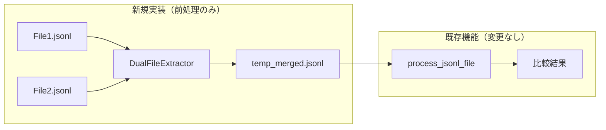
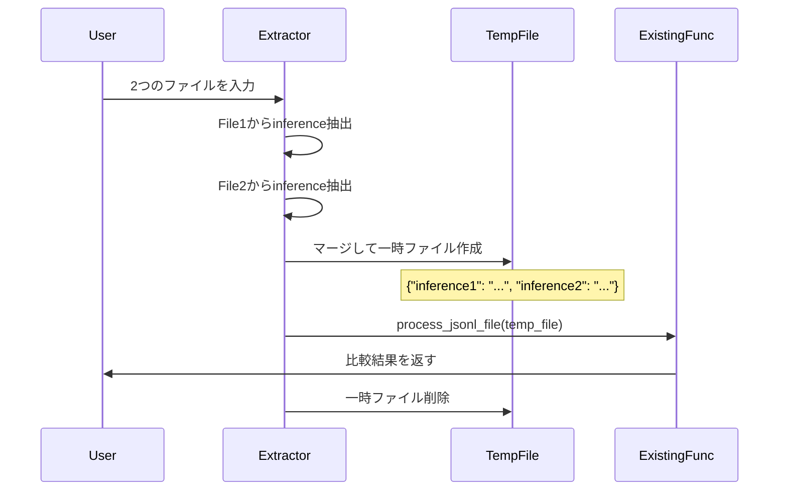

# 技術設計書: dual-file-inference-compare

## 概要

**目的**: 2つの異なるJSONLファイルからinference列を抽出し、一時ファイルを作成して既存の比較機能（process_jsonl_file）をそのまま利用することで、モデル出力の差異を定量的に評価します。

**利用者**: MLエンジニア、データサイエンティスト、品質保証チームが、異なるモデルやバージョンの出力を比較する際に使用します。

**影響**: 既存コードへの変更を一切行わず、前処理層の追加のみで2ファイル比較機能を実現します。

### ゴール
- 2つのJSONLファイルから指定された列（デフォルト: inference）を抽出
- 一時的な中間ファイルを生成（inference1/inference2形式）
- 既存のprocess_jsonl_file関数をそのまま使用
- CLI、Web UI、APIから利用可能
- 比較する列名をパラメータとして指定可能

### 非ゴール
- 既存コード（process_jsonl_file等）の改修
- 複雑な非同期処理やジョブ管理システム
- 3つ以上のファイル同時比較
- カスタム類似度アルゴリズムの実装

## アーキテクチャ

### コアコンセプト

既存システムに一切手を加えず、前処理層のみで2ファイル比較を実現します：



### シンプルな処理フロー



### 技術的意思決定

**唯一の決定: 一時ファイルによる既存機能の完全再利用**
- **決定**: 物理的な一時ファイルを作成して既存機能に渡す
- **理由**: 既存コードを一切変更せずに機能追加が可能
- **実装**: Pythonのtempfileモジュールで安全に一時ファイル管理
- **トレードオフ**: わずかなディスクI/O vs 既存機能の100%再利用

## コンポーネントとインターフェース

### DualFileExtractor（唯一の新規コンポーネント）

**責任**
- 2つのJSONLファイルから指定された列を抽出
- 一時ファイルの作成と削除
- 既存のprocess_jsonl_file関数の呼び出し

**シンプルなインターフェース**
```python
class DualFileExtractor:
    def compare_dual_files(
        self,
        file1_path: str,
        file2_path: str,
        column_name: str = "inference",
        output_type: str = "score",
        use_gpu: bool = False
    ) -> Dict[str, Any]:
        """
        2ファイルを比較して結果を返す
        1. 両ファイルから指定列（デフォルト: inference）を抽出
        2. 一時ファイルにマージ（inference1/inference2として）
        3. process_jsonl_file()を呼び出し
        4. 一時ファイルを削除
        5. 結果を返す
        """
```

**実装詳細**
```python
def _create_temp_file(self, inferences1: List, inferences2: List) -> str:
    """一時ファイルを作成"""
    with tempfile.NamedTemporaryFile(mode='w', suffix='.jsonl', delete=False) as tmp:
        for inf1, inf2 in zip(inferences1, inferences2):
            line = {
                "inference1": inf1,
                "inference2": inf2
            }
            tmp.write(json.dumps(line, ensure_ascii=False) + '\n')
        return tmp.name
```

### CLI統合

**新しいCLIコマンド**
```python
@app.command()
def dual(
    file1: str = typer.Argument(..., help="1つ目のJSONLファイル"),
    file2: str = typer.Argument(..., help="2つ目のJSONLファイル"),
    column: str = typer.Option("inference", help="比較する列名"),
    type: str = typer.Option("score", help="出力タイプ"),
    gpu: bool = typer.Option(False, help="GPU使用"),
    output: Optional[str] = typer.Option(None, help="出力ファイル")
):
    """2つのJSONLファイルの指定列を比較"""
    extractor = DualFileExtractor()
    result = extractor.compare_dual_files(file1, file2, column, type, gpu)
    # 結果の出力処理
```

### API統合

**シンプルなAPIエンドポイント**
```python
@app.post("/api/compare/dual")
async def compare_dual_files(
    file1: UploadFile = File(...),
    file2: UploadFile = File(...),
    column: str = Form("inference"),
    type: str = Form("score"),
    gpu: bool = Form(False)
):
    """2ファイル比較API（同期処理）"""
    # ファイルを一時保存
    temp_file1 = save_upload_file(file1)
    temp_file2 = save_upload_file(file2)

    try:
        # DualFileExtractorを使用
        extractor = DualFileExtractor()
        result = extractor.compare_dual_files(temp_file1, temp_file2, column, type, gpu)
        return result
    finally:
        # アップロードされたファイルの削除
        cleanup_files([temp_file1, temp_file2])
```

### Web UI統合

**HTMLフォームの拡張**
```html
<form id="dualCompareForm">
    <div class="file-input-group">
        <label>ファイル1</label>
        <input type="file" name="file1" accept=".jsonl" required>
    </div>
    <div class="file-input-group">
        <label>ファイル2</label>
        <input type="file" name="file2" accept=".jsonl" required>
    </div>
    <div class="input-group">
        <label>比較する列名</label>
        <input type="text" name="column" value="inference" placeholder="列名を入力">
    </div>
    <select name="type">
        <option value="score">スコア形式</option>
        <option value="file">ファイル形式</option>
    </select>
    <button type="submit">比較実行</button>
</form>
```

## データフォーマット

### 入力ファイル形式（File1, File2）
```jsonl
{"id": 1, "input": "テキスト", "inference": "推論結果A", "other": "..."}
{"id": 2, "input": "テキスト", "inference": "推論結果B", "other": "..."}
```

### 一時ファイル形式（自動生成）
```jsonl
{"inference1": "推論結果A", "inference2": "推論結果A'"}
{"inference1": "推論結果B", "inference2": "推論結果B'"}
```

### 出力形式
既存のprocess_jsonl_fileの出力形式をそのまま使用：
- score形式: 全体の類似度スコアと統計
- file形式: 各行の詳細比較結果

## エラーハンドリング

### シンプルなエラー処理

**ファイル検証**
```python
def validate_files(self, file1: str, file2: str):
    # ファイル存在確認
    if not os.path.exists(file1):
        raise FileNotFoundError(f"File1が見つかりません: {file1}")

    # inference列の存在確認
    with open(file1, 'r') as f:
        first_line = json.loads(f.readline())
        if 'inference' not in first_line:
            raise ValueError("File1にinference列がありません")
```

**一時ファイルクリーンアップ**
```python
def cleanup_temp_file(self, temp_path: str):
    try:
        if os.path.exists(temp_path):
            os.remove(temp_path)
    except Exception as e:
        logger.warning(f"一時ファイル削除失敗: {e}")
```

### エラーメッセージ
- ファイル不存在: "指定されたファイルが見つかりません"
- inference列欠落: "inference列が存在しません"
- 行数不一致警告: "ファイルの行数が異なります（短い方に合わせます）"

## 実装の簡潔性

### ファイル数
- 新規作成: `dual_file_extractor.py`（1ファイルのみ）
- 既存ファイル変更: なし

### 実装ステップ
1. DualFileExtractorクラスを実装
2. CLIコマンドを追加（`__main__.py`に数行追加）
3. APIエンドポイントを追加（`api.py`に1関数追加）
4. Web UIフォームを更新（HTMLに数要素追加）

### 依存関係
- 標準ライブラリ: tempfile, json, os
- 既存機能: process_jsonl_file（変更なし）

## テスト戦略

### 単体テスト
- inference列の抽出: 正常/欠落ケース
- 一時ファイル生成: 形式確認
- クリーンアップ: ファイル削除確認

### 統合テスト
- CLI実行: `json_compare dual file1.jsonl file2.jsonl`
- API呼び出し: 2ファイルアップロード
- 既存機能との連携: process_jsonl_file呼び出し確認

### エンドツーエンドテスト
- Web UIでの2ファイル比較フロー
- 結果の正確性確認
- エラーケースの処理

## まとめ

本設計は「既存機能を一切変更せずに2ファイル比較を実現する」という方針を徹底しています。DualFileExtractorという単一のコンポーネントが、2ファイルからの抽出、一時ファイル生成、既存機能呼び出し、クリーンアップまでを担当し、シンプルで保守しやすい実装を実現します。