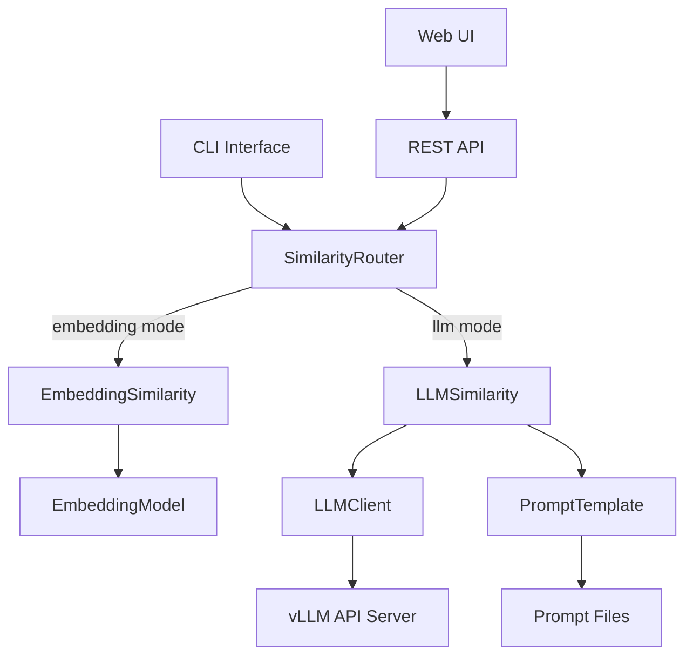
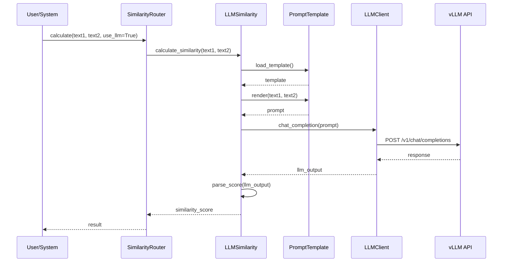
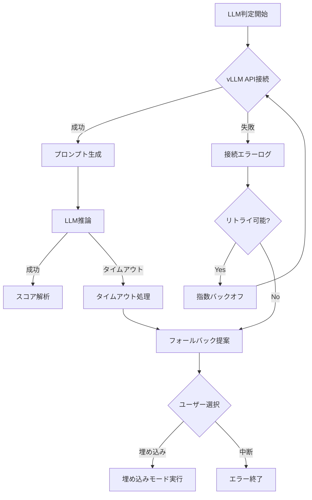

# Technical Design Document

## Overview

この機能は、JSON Compareツールに vLLM APIを活用したLLMベースの類似度判定をオプション機能として追加します。既存の埋め込みベース手法と併用可能で、より高度な文脈理解に基づいた類似度評価を実現します。

**Purpose**: 複雑な日本語文脈の理解と、カスタマイズ可能な評価基準による柔軟な類似度判定を提供します。
**Users**: MLエンジニア、データサイエンティスト、品質保証担当者が、より精密な推論結果の評価に活用します。
**Impact**: 既存の類似度計算機能を拡張し、`--llm`フラグによる選択的な利用を可能にします。

### Goals
- vLLM API (qwen3-14b-awq) を使用したLLMベース類似度判定の実装
- プロンプトテンプレートの外部ファイル管理機能
- CLI、Web UI、APIの全インターフェースでの統一的な体験
- 既存の埋め込みベース機能との完全な互換性維持

### Non-Goals
- LLMモデルの自前ホスティング（vLLM APIの利用前提）
- リアルタイム・ストリーミング応答（バッチ処理のみ）
- 複数LLMの並列利用による投票システム

## Architecture

### Existing Architecture Analysis

現在のアーキテクチャは以下のコンポーネントで構成されています：
- **CLI層**: `__main__.py` による argparse ベースのコマンドライン処理
- **ビジネスロジック層**: `similarity.py` と `embedding.py` による類似度計算
- **API層**: `api.py` による FastAPI エンドポイントと Web UI
- **インフラ層**: `error_handler.py`、`logger.py` による横断的機能

統合に際しては、既存のパターンを維持し、新機能を Strategy パターンで追加します。

### High-Level Architecture



**Architecture Integration**:
- 既存パターン維持: Strategy パターンによる類似度計算の切り替え
- 新コンポーネント理由: LLMベース判定のカプセル化と設定管理の分離
- 技術スタック整合: 既存の httpx 依存を活用、YAML設定は既存パターン踏襲

### Technology Stack and Design Decisions

**Technology Alignment**:
- HTTPクライアント: httpx (既存依存を活用)
- 設定管理: YAML (PyYAML - 新規追加)
- 非同期処理: asyncio (既存のFastAPI基盤を活用)

**Key Design Decisions**:

1. **Decision**: Strategyパターンによる類似度計算の切り替え
   - **Context**: 既存の埋め込みベース機能と新規LLM機能の共存が必要
   - **Alternatives**: 継承階層、条件分岐、プラグインシステム
   - **Selected Approach**: SimilarityRouterクラスによる動的戦略選択
   - **Rationale**: 既存コードへの影響最小化と将来の拡張性確保
   - **Trade-offs**: わずかな複雑性増加 vs 高い保守性と拡張性

2. **Decision**: YAMLベースのプロンプトテンプレート管理
   - **Context**: データサイエンティストによる評価基準のカスタマイズ要求
   - **Alternatives**: Python文字列、JSONファイル、データベース保存
   - **Selected Approach**: YAMLファイルでのプロンプト定義と変数置換
   - **Rationale**: 可読性とバージョン管理の容易さ、既存のYAML利用パターンとの整合
   - **Trade-offs**: ファイルI/O vs 柔軟な設定変更

## System Flows

### LLMベース類似度判定フロー



### エラーハンドリングとフォールバック



## Components and Interfaces

### 類似度計算層

#### LLMSimilarity

**Responsibility & Boundaries**
- **Primary Responsibility**: vLLM APIを使用した類似度スコアの算出
- **Domain Boundary**: 類似度計算ドメイン内のLLM戦略実装
- **Data Ownership**: プロンプトテンプレート、LLM応答のキャッシュ
- **Transaction Boundary**: 単一の類似度計算リクエスト

**Dependencies**
- **Inbound**: SimilarityRouter、CLI/API層
- **Outbound**: LLMClient、PromptTemplate、ScoreParser
- **External**: httpx、PyYAML

**Contract Definition**

```typescript
interface LLMSimilarityService {
  calculate_similarity(
    text1: str,
    text2: str,
    config: LLMConfig
  ): Result<SimilarityScore, LLMError>;

  validate_connection(): Result<bool, ConnectionError>;

  set_prompt_template(template_path: str): Result<void, TemplateError>;
}

interface SimilarityScore {
  score: float;  // 0.0 - 1.0
  category: str; // "完全一致" | "非常に類似" | "類似" | "やや類似" | "低い類似度"
  raw_response: str;
  confidence: float;
}
```

**Integration Strategy**
- **Modification Approach**: 既存の EmbeddingModel クラスと並列に新規クラス作成
- **Backward Compatibility**: 既存インターフェース完全維持、フラグによる切り替え
- **Migration Path**: 段階的移行のためのA/Bテスト機能提供

### 外部通信層

#### LLMClient

**Responsibility & Boundaries**
- **Primary Responsibility**: vLLM API との HTTP 通信管理
- **Domain Boundary**: 外部システム統合層
- **Data Ownership**: API認証情報、リトライ状態
- **Transaction Boundary**: 単一のAPI呼び出し

**Dependencies**
- **Inbound**: LLMSimilarity
- **Outbound**: なし
- **External**: httpx、vLLM API (http://192.168.1.18:8000)

**Contract Definition**

```typescript
interface LLMClientService {
  async chat_completion(
    messages: Message[],
    model: str = "qwen3-14b-awq",
    temperature: float = 0.2,
    max_tokens: int = 64
  ): Result<ChatResponse, APIError>;

  async health_check(): Result<bool, ConnectionError>;
}

interface ChatResponse {
  id: str;
  choices: Choice[];
  usage: TokenUsage;
  created: int;
}
```

**State Management**
- **State Model**: 接続状態（未接続、接続中、接続済み、エラー）
- **Concurrency**: 接続プールによる並行リクエスト制御（最大5接続）

### 設定管理層

#### PromptTemplate

**Responsibility & Boundaries**
- **Primary Responsibility**: プロンプトテンプレートの読み込みと変数置換
- **Domain Boundary**: 設定管理ドメイン
- **Data Ownership**: テンプレートファイルのキャッシュ
- **Transaction Boundary**: テンプレート読み込み単位

**Contract Definition**

```typescript
interface PromptTemplateService {
  load_template(file_path: str): Result<Template, IOError>;

  render(
    template: Template,
    variables: Dict[str, str]
  ): Result<str, RenderError>;

  validate_template(template: Template): Result<bool, ValidationError>;
}

interface Template {
  system_prompt: str;
  user_prompt: str;
  variables: List[str];  // ["text1", "text2"]
  output_format: str;
}
```

### インターフェース拡張

#### CLI拡張

**API Contract**

| オプション | 型 | デフォルト | 説明 |
|----------|-----|------------|------|
| --llm | flag | False | LLMベース判定を使用 |
| --prompt-file | str | prompts/default_similarity.yaml | プロンプトファイル |
| --model | str | qwen3-14b-awq | 使用するLLMモデル |
| --temperature | float | 0.2 | 生成温度パラメータ |
| --max-tokens | int | 64 | 最大生成トークン数 |

#### Web UI拡張

**API Contract**

| Method | Endpoint | Request | Response |
|--------|----------|---------|----------|
| POST | /api/compare | CompareRequestWithLLM | SimilarityResponse |
| GET | /api/prompts | - | PromptList |
| POST | /api/prompts/upload | PromptFile | PromptUploadResponse |

```typescript
interface CompareRequestWithLLM extends CompareRequest {
  use_llm: boolean;
  prompt_file?: str;
  llm_config?: LLMConfig;
}
```

## Data Models

### Domain Model

**Core Concepts**:
- **SimilarityMethod**: 類似度計算方式（Embedding | LLM）
- **LLMConfig**: LLM関連の設定集約
- **PromptVariable**: テンプレート内の置換可能変数

### Logical Data Model

```yaml
# プロンプトテンプレート構造
prompt_template:
  version: "1.0"
  metadata:
    author: string
    description: string
    created_at: datetime

  prompts:
    system: string
    user: |
      以下の2つのテキストの類似度を評価してください。

      テキスト1: {text1}
      テキスト2: {text2}

      類似度を以下の形式で回答してください：
      - スコア: 0.0-1.0の数値
      - カテゴリ: 完全一致/非常に類似/類似/やや類似/低い類似度
      - 理由: 判定の根拠

  parameters:
    temperature: 0.2
    max_tokens: 64
    chat_template_kwargs:
      enable_thinking: false
```

```yaml
# LLM設定ファイル構造
llm_config:
  api:
    url: "http://192.168.1.18:8000/v1/chat/completions"
    auth_token: "EMPTY"
    timeout: 30

  model:
    name: "qwen3-14b-awq"
    temperature: 0.2
    max_tokens: 64

  retry:
    max_attempts: 3
    backoff_factor: 2
    max_delay: 10

  fallback:
    auto_fallback: true
    prompt_user: true
```

### Data Contracts & Integration

**API Data Transfer**:

```typescript
// vLLM API Request
interface VLLMRequest {
  model: string;
  messages: Array<{
    role: "system" | "user" | "assistant";
    content: string;
  }>;
  temperature: number;
  max_tokens: number;
  chat_template_kwargs?: {
    enable_thinking: boolean;
  };
}

// Internal Processing
interface SimilarityResult {
  score: number;
  meaning: string;
  method: "embedding" | "llm";
  processing_time: number;
  metadata: {
    model_used?: string;
    prompt_file?: string;
    llm_raw_response?: string;
  };
}
```

## Error Handling

### Error Strategy

各エラータイプに対する具体的な処理とリカバリメカニズムを定義します。

### Error Categories and Responses

**接続エラー (ConnectionError)**
- vLLM API接続失敗 → 3回リトライ後、埋め込みモードへのフォールバック提案
- タイムアウト → プログレスバー表示、30秒後に中断オプション提供

**設定エラー (ConfigurationError)**
- プロンプトファイル不在 → デフォルトプロンプト使用提案と作成例表示
- YAMLパースエラー → エラー行番号と修正例を表示

**処理エラー (ProcessingError)**
- LLM応答解析失敗 → 該当行スキップ、エラーログ記録
- スコア抽出失敗 → カテゴリベースの推定値使用

### Monitoring

- APIコール応答時間のメトリクスログ記録
- エラー発生率とフォールバック使用率の追跡
- LLMモデル別の成功率統計

## Testing Strategy

### Unit Tests
- LLMClient: モックvLLM APIレスポンスによる通信テスト
- PromptTemplate: テンプレート読み込みと変数置換テスト
- ScoreParser: 各種LLM出力形式の解析テスト
- LLMConfig: 設定ファイル読み込みとバリデーションテスト

### Integration Tests
- CLI統合: `--llm`フラグ付き実行フロー全体
- API統合: `/api/compare` エンドポイントでのLLMモード
- フォールバック: API失敗時の埋め込みモード切り替え
- プロンプト管理: カスタムプロンプトファイルの適用

### E2E/Web UI Tests (Playwright MCP使用)
- **テストツール**: Playwright MCP を使用した自動化テスト
- LLMモードチェックボックス: 選択状態の切り替えと表示確認
- ファイルアップロード: LLMモードでの処理完了確認
- プロンプトファイル選択: カスタムプロンプトのアップロードと適用
- エラーシナリオ: 接続失敗時のエラーメッセージとフォールバック提案の表示確認
- 結果表示: LLM判定結果とメタデータ（使用モデル、プロンプト等）の表示確認

## Security Considerations

### API認証とアクセス制御
- vLLM APIトークンの環境変数管理
- APIキーのログ出力禁止
- HTTPSによる通信暗号化（本番環境）

### 入力検証とサニタイゼーション
- プロンプトインジェクション対策
- ファイルパスのトラバーサル攻撃防止
- YAML読み込み時の安全なローダー使用

### データ保護
- LLM応答の一時的なメモリ保持のみ
- センシティブ情報のマスキング機能
- 処理ログでのPII除外