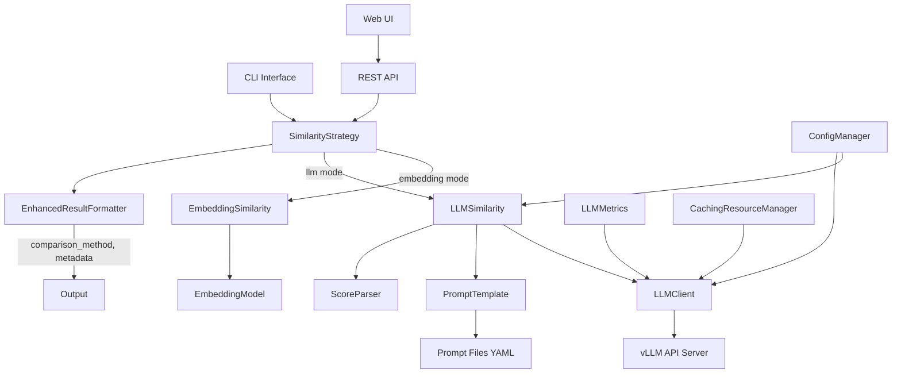
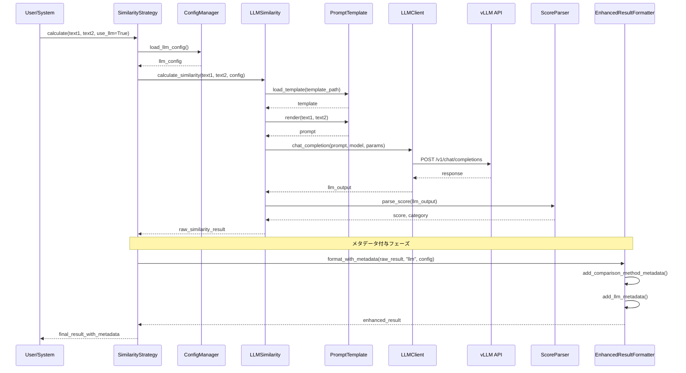
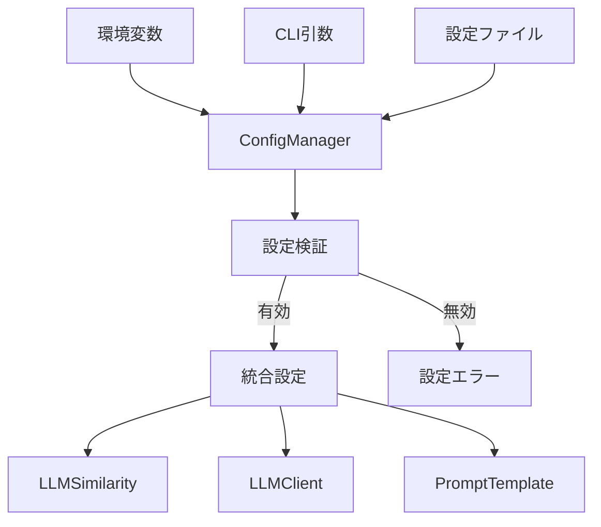

# 技術設計書

## Overview

この機能は、JSON CompareツールにvLLM APIを活用したLLMベースの類似度判定をオプション機能として追加します。既存の埋め込みベース手法と併用可能で、より高度な文脈理解に基づいた類似度評価を実現し、使用した比較手法を明確に識別します。

**Purpose**: 複雑な日本語文脈の理解と、カスタマイズ可能な評価基準による柔軟な類似度判定を提供し、比較手法の透明性を確保した信頼性の高い評価システムを構築します。

**Users**: MLエンジニア、データサイエンティストが、高度な文脈理解による類似度判定と、使用手法の明確な識別により、より精密で透明性の高い推論結果の評価に活用します。

**Impact**: 既存の類似度計算機能を拡張し、比較方法の明示的識別により結果の透明性と信頼性を向上させます。LLMベースと埋め込みベースの手法を戦略的に切り替え可能なハイブリッド評価システムを実現します。

### Goals

- vLLM API (qwen3-14b-awq等) を使用したLLMベース類似度判定の実装
- 比較方法の明示的識別（`comparison_method`フィールド）とメタデータ強化による透明性確保
- YAMLベースのプロンプトテンプレート管理システム
- CLI、Web UI、APIの全インターフェースでの統一的な体験
- 既存の埋め込みベース機能との完全な互換性維持
- 設定ファイル管理とパフォーマンス監視機能

### Non-Goals

- LLMモデルの自前ホスティング（vLLM APIの利用前提）
- リアルタイム・ストリーミング応答（バッチ処理のみ）
- 複数LLMの並列利用による投票システム
- 結果検証と品質保証機能（ユーザー要求により除外）

## Architecture

### Existing Architecture Analysis

現在のアーキテクチャは以下のコンポーネントで構成されています：
- **CLI層**: `__main__.py` によるargparseベースのコマンドライン処理
- **ビジネスロジック層**: `similarity.py`と`embedding.py`による類似度計算
- **API層**: `api.py`によるFastAPIエンドポイントとWeb UI
- **インフラ層**: `error_handler.py`、`logger.py`による横断的機能

統合に際しては、既存のパターンを維持し、新機能をStrategyパターンで追加します。結果フォーマッティング層を強化して比較方法の識別を実現します。

### High-Level Architecture



**Architecture Integration**:
- 既存パターン維持: Strategyパターンによる類似度計算の切り替え
- 新コンポーネント理由: LLMベース判定のカプセル化とメタデータ管理の強化
- 技術スタック整合: 既存のhttpx依存を活用、YAML設定は新規追加
- 結果フォーマッティング層強化: 比較方法識別とメタデータ付与

### Technology Alignment

**Existing Technology Stack Integration**:
- HTTPクライアント: httpx (既存依存を活用)
- 設定管理: PyYAML 6.0+ (新規追加)
- 非同期処理: asyncio (既存のFastAPI基盤を活用)
- ログ管理: 既存のlogger.pyシステムを拡張
- エラーハンドリング: 既存のerror_handler.pyパターンを踏襲

**Key Design Decisions**:

1. **Decision**: Strategyパターンによる類似度計算の切り替え
   - **Context**: 既存の埋め込みベース機能と新規LLM機能の共存が必要
   - **Alternatives**: 継承階層、条件分岐、プラグインシステム
   - **Selected Approach**: SimilarityStrategyクラスによる動的戦略選択
   - **Rationale**: 既存コードへの影響最小化と将来の拡張性確保
   - **Trade-offs**: わずかな複雑性増加 vs 高い保守性と拡張性

2. **Decision**: YAMLベースのプロンプトテンプレート管理
   - **Context**: データサイエンティストによる評価基準のカスタマイズ要求
   - **Alternatives**: Python文字列、JSONファイル、データベース保存
   - **Selected Approach**: YAMLファイルでのプロンプト定義と変数置換
   - **Rationale**: 可読性とバージョン管理の容易さ、既存のYAML利用パターンとの整合
   - **Trade-offs**: ファイルI/O vs 柔軟な設定変更

3. **Decision**: 設定管理の階層化（環境変数 > CLI > 設定ファイル）
   - **Context**: 複数環境での柔軟な設定管理が必要
   - **Alternatives**: 単一設定ファイル、環境変数のみ
   - **Selected Approach**: 優先順位付き設定層の実装
   - **Rationale**: 環境固有の設定とユーザ設定の両立
   - **Trade-offs**: 設定の複雑性 vs 運用の柔軟性

## System Flows

### LLMベース類似度判定フロー



### 設定管理フロー



## Requirements Traceability

| Requirement | 実装コンポーネント | インターフェース | フロー参照 |
|-------------|------------------|----------------|-----------|
| Req 1.1-1.5 | LLMSimilarity, LLMClient | calculate_similarity(), chat_completion() | LLMベース判定フロー |
| Req 2.1-2.5 | PromptTemplate | load_template(), render() | LLMベース判定フロー |
| Req 3.1-3.5 | ConfigManager, CLI拡張 | load_config(), parse_args() | 設定管理フロー |
| Req 4.1-4.5 | ScoreParser | parse_score(), categorize_score() | LLMベース判定フロー |
| Req 5.1-5.5 | API拡張, WebUI拡張 | /api/compare拡張, UI要素 | インターフェース統合 |
| Req 6.1-6.5 | LLMMetrics, ErrorHandler | メトリクス記録, リトライ処理 | エラーハンドリングフロー |
| Req 7.1-7.5 | ConfigManager | ファイル管理, バリデーション | 設定管理フロー |
| Req 8.1 | EnhancedResultFormatter | add_comparison_method() | LLMベース判定フロー |
| Req 8.3 | EnhancedResultFormatter | add_llm_metadata() | LLMベース判定フロー |
| Req 8.4 | EnhancedResultFormatter | add_embedding_metadata() | LLMベース判定フロー |
| Req 8.5 | ScoreParser | validate_score_range() | LLMベース判定フロー |

## Components and Interfaces

### 類似度計算層

#### LLMSimilarity

**Responsibility & Boundaries**
- **Primary Responsibility**: vLLM APIを使用した類似度スコアの算出
- **Domain Boundary**: 類似度計算ドメイン内のLLM戦略実装
- **Data Ownership**: プロンプトテンプレート、LLM応答の一時データ
- **Transaction Boundary**: 単一の類似度計算リクエスト

**Dependencies**
- **Inbound**: SimilarityStrategy、CLI/API層
- **Outbound**: LLMClient、PromptTemplate、ScoreParser
- **External**: httpx、PyYAML、CachingResourceManager

**Contract Definition**

```typescript
interface LLMSimilarityService {
  calculate_similarity(
    text1: str,
    text2: str,
    config: LLMConfig
  ): Result<RawSimilarityResult, LLMError>;

  validate_connection(): Result<bool, ConnectionError>;
  set_prompt_template(template_path: str): Result<void, TemplateError>;
  get_metrics(): LLMMetrics;
}

interface RawSimilarityResult {
  score: float;  // 0.0 - 1.0
  category: str;
  raw_response: str;
  confidence: float;
  processing_time: float;
  model_name: str;
  prompt_template: str;
}
```

#### PromptTemplate

**Responsibility & Boundaries**
- **Primary Responsibility**: YAMLプロンプトテンプレートの読み込みと変数置換
- **Domain Boundary**: プロンプト管理ドメイン
- **Data Ownership**: テンプレートキャッシュ
- **Transaction Boundary**: 単一のプロンプト生成処理

**Contract Definition**

```typescript
interface PromptTemplateService {
  load_template(file_path: str): Result<PromptTemplate, TemplateError>;
  render(template: PromptTemplate, text1: str, text2: str): Result<str, RenderError>;
  validate_template(template: PromptTemplate): Result<bool, ValidationError>;
  get_default_template(): PromptTemplate;
}

interface PromptTemplate {
  system_prompt: str;
  user_prompt_template: str;
  temperature: float;
  max_tokens: int;
  variables: Dict<str, str>;
}
```

#### ScoreParser

**Responsibility & Boundaries**
- **Primary Responsibility**: LLM応答からの数値スコア抽出と分類
- **Domain Boundary**: スコア解析ドメイン
- **Data Ownership**: 解析ルールとカテゴリマッピング
- **Transaction Boundary**: 単一の応答解析処理

**Contract Definition**

```typescript
interface ScoreParserService {
  parse_score(llm_response: str): Result<ScoreResult, ParseError>;
  categorize_score(score: float): str;
  extract_numeric_score(text: str): Result<float, ExtractionError>;
  estimate_score_from_text(text: str): float;
  validate_score_range(score: float): float;  // Req 8.5
}

interface ScoreResult {
  score: float;
  category: str;
  confidence: float;
  extraction_method: str;
}
```

### 外部通信層

#### LLMClient

**Responsibility & Boundaries**
- **Primary Responsibility**: vLLM APIとの通信とレスポンス管理
- **Domain Boundary**: 外部API通信ドメイン
- **Data Ownership**: API接続状態、レスポンスキャッシュ
- **Transaction Boundary**: 単一のAPI呼び出し

**Dependencies**
- **External**: vLLM API Server (http://192.168.1.18:8000)

**Contract Definition**

```typescript
interface LLMClientService {
  async chat_completion(
    messages: Message[],
    model: str = "qwen3-14b-awq",
    temperature: float = 0.2,
    max_tokens: int = 64
  ): Result<ChatResponse, APIError>;

  async health_check(): Result<bool, ConnectionError>;
  get_response_time_metrics(): ResponseTimeMetrics;
  set_timeout(seconds: int): void;
}

interface ChatResponse {
  content: str;
  model: str;
  usage: TokenUsage;
  response_time: float;
}
```

**State Management**
- **State Model**: 接続状態（未接続、接続中、接続済み、エラー）
- **Concurrency**: 順次処理による レート制限回避（Requirement 6.5）

### 設定管理層

#### ConfigManager

**Responsibility & Boundaries**
- **Primary Responsibility**: LLM関連設定の一元管理とバリデーション
- **Domain Boundary**: 設定管理ドメイン
- **Data Ownership**: 設定ファイル、統合設定
- **Transaction Boundary**: 設定読み込み・保存処理

**Contract Definition**

```typescript
interface ConfigManagerService {
  load_config(): Result<LLMConfig, ConfigError>;
  save_config(config: LLMConfig): Result<void, SaveError>;
  validate_config(config: LLMConfig): Result<bool, ValidationError>;
  merge_configs(env: EnvConfig, cli: CLIConfig, file: FileConfig): LLMConfig;
}

interface LLMConfig {
  api_url: str;
  api_key?: str;
  model_name: str;
  temperature: float;
  max_tokens: int;
  timeout: int;
  prompt_template_path: str;
  cache_enabled: bool;
}
```

### 結果フォーマッティング層

#### EnhancedResultFormatter

**Responsibility & Boundaries**
- **Primary Responsibility**: 比較方法識別とメタデータ付与
- **Domain Boundary**: 結果フォーマッティングドメイン
- **Data Ownership**: メタデータテンプレート
- **Transaction Boundary**: 単一の結果フォーマット処理

**Integration Strategy**
- **Modification Approach**: 既存の出力形式を拡張（破壊的変更なし）
- **Backward Compatibility**: 既存フィールドは維持、新規フィールドを追加
- **Migration Path**: 段階的な移行（comparison_methodフィールドの追加）

**Contract Definition**

```typescript
interface EnhancedResultFormatterService {
  format_with_metadata(
    raw_result: RawSimilarityResult,
    method: ComparisonMethod,
    config: MethodConfig
  ): Result<EnhancedSimilarityResult, FormatError>;

  add_comparison_method_metadata(
    result: SimilarityResult,
    method: ComparisonMethod
  ): EnhancedSimilarityResult;

  add_llm_metadata(result: SimilarityResult, llm_data: LLMData): void;
  add_embedding_metadata(result: SimilarityResult, embedding_data: EmbeddingData): void;
}

interface EnhancedSimilarityResult {
  // 基本フィールド
  score: float;
  meaning: str;
  comparison_method: "embedding" | "llm";  // 必須フィールド (Req 8.1)

  // 共通メタデータ
  processing_time: float;
  timestamp: str;

  // LLM固有メタデータ (Req 8.3)
  llm_model_name?: str;
  prompt_template?: str;
  llm_response_time?: float;
  llm_raw_response?: str;

  // 埋め込み固有メタデータ (Req 8.4)
  embedding_model_name?: str;
  similarity_algorithm?: str;
  embedding_dimension?: int;
}
```

### インターフェース拡張

#### CLI拡張

**API Contract**

| オプション | 型 | デフォルト | 説明 |
|----------|-----|------------|------|
| --llm | flag | False | LLMベース判定を使用 |
| --prompt-file | str | prompts/default_similarity.yaml | プロンプトファイル |
| --model | str | qwen3-14b-awq | 使用するLLMモデル |
| --temperature | float | 0.2 | 生成温度パラメータ |
| --max-tokens | int | 64 | 最大生成トークン数 |
| --save-config | flag | False | 現在の設定を保存 |

## Data Models

### Domain Model

**Core Concepts**:
- **ComparisonMethod**: 類似度計算方式（Embedding | LLM）
- **MetadataTemplate**: 手法別メタデータテンプレート
- **ResultFormatter**: 結果フォーマッティング戦略
- **ConfigurationHierarchy**: 設定の優先順位管理

### Enhanced Logical Data Model

```yaml
# 拡張された結果データ構造
enhanced_similarity_result:
  # 必須フィールド（Requirement 8.1）
  comparison_method: "embedding" | "llm"
  score: float  # 0.0-1.0
  meaning: string

  # 共通メタデータ
  processing_time: float
  timestamp: datetime

  # LLM固有メタデータ（Requirement 8.3）
  llm_metadata:
    model_name: string
    prompt_template: string
    response_time: float
    raw_response: string
    token_usage: integer

  # 埋め込み固有メタデータ（Requirement 8.4）
  embedding_metadata:
    model_name: string
    similarity_algorithm: string
    embedding_dimension: integer
    computation_time: float

# 設定データ構造
llm_config:
  api:
    url: string
    key: string
    timeout: integer
  model:
    name: string
    temperature: float
    max_tokens: integer
  prompt:
    template_path: string
    variables: dict
  cache:
    enabled: boolean
    size: integer
```

### Data Contracts & Integration

**Enhanced API Data Transfer**:

```typescript
// 拡張されたAPIレスポンス（Requirement 8.1, 8.3-8.4）
interface EnhancedComparisonResponse {
  // 従来フィールド
  score: number;
  meaning: string;
  total_lines: number;

  // 必須追加フィールド
  comparison_method: "embedding" | "llm";

  // 拡張メタデータ
  metadata: {
    processing_time: number;

    // 手法固有メタデータ
    llm_metadata?: LLMMetadata;
    embedding_metadata?: EmbeddingMetadata;
  };
}

interface LLMMetadata {
  model_name: string;
  prompt_template: string;
  response_time: number;
  raw_response: string;
  token_usage: number;
}

interface EmbeddingMetadata {
  model_name: string;
  similarity_algorithm: string;
  embedding_dimension: number;
  computation_time: number;
}
```

## Error Handling

### Error Strategy

各エラータイプに対する具体的な処理とリカバリメカニズムを定義します。

### Error Categories and Responses

**接続エラー (ConnectionError)**
- vLLM API接続失敗 → 3回リトライ後、埋め込みモードへのフォールバック提案 (Req 1.4)
- タイムアウト → プログレスバー表示、30秒後に中断オプション提供 (Req 1.5)

**設定エラー (ConfigurationError)**
- プロンプトファイル不在 → デフォルトプロンプト使用提案と作成例表示 (Req 2.3)
- YAML パースエラー → エラー行番号と修正例を表示 (Req 2.4)
- 設定値バリデーション失敗 → 詳細なエラーメッセージと正しい形式表示 (Req 7.3)

**処理エラー (ProcessingError)**
- LLM応答解析失敗 → 該当行スキップ、明示的な失敗マーカー（"PARSE_FAILED"）出力 (Req 4.4)
- スコア抽出失敗 → カテゴリベースの推定値使用 (Req 4.2)
- スコア範囲外 → 自動クランプと警告ログ出力 (Req 8.5)

**レート制限エラー (RateLimitError)**
- レート制限検出 → 指数バックオフでリトライ (Req 6.4)
- 連続失敗 → 埋め込みモードへフォールバック (Req 6.3)

### Monitoring

- APIコール応答時間のメトリクスログ記録 (Req 6.1)
- エラー発生率とフォールバック使用率の追跡
- LLMモデル別の成功率統計
- 設定変更ログの記録

## Testing Strategy

### Unit Tests
- LLMClient: vLLM API通信とエラーハンドリング
- PromptTemplate: テンプレート読み込みと変数置換
- ScoreParser: 各種LLM出力形式の解析と分類
- ConfigManager: 設定階層管理とバリデーション
- EnhancedResultFormatter: メタデータ付与と比較方法識別

### Integration Tests
- CLI統合: `--llm`フラグ付き実行フロー全体
- API統合: `/api/compare`エンドポイントでのLLMモード
- フォールバック: API失敗時の埋め込みモード切り替え
- 設定管理: 環境変数、CLI、ファイルの優先順位テスト

### E2E/Web UI Tests (Playwright MCP使用)
- LLMモードチェックボックス: 選択状態の切り替えと表示確認
- ファイルアップロード: LLMモードでの処理完了確認
- プロンプトファイル選択: カスタムプロンプトのアップロードと適用
- メタデータ表示: 比較方法識別フィールドとメタデータの表示確認
- 設定保存: `--save-config`オプションの動作確認

## Security Considerations

### API認証とアクセス制御
- vLLM APIトークンの環境変数管理 (Req 3.5)
- APIキーのログ出力禁止
- HTTPSによる通信暗号化（本番環境）

### 入力検証とサニタイゼーション
- プロンプトインジェクション対策
- ファイルパスのトラバーサル攻撃防止
- YAML読み込み時の安全なローダー使用
- 設定値の範囲チェックとサニタイゼーション

### データ保護
- LLM応答の一時的なメモリ保持のみ
- センシティブ情報のマスキング機能
- 処理ログでのPII除外
- 設定ファイルの適切な権限管理

## Performance & Scalability

### Target Metrics
- LLM API応答時間: 5秒以内（90%tile） (Req 6.2)
- メタデータ付与処理時間: 10ms以内
- 設定読み込み時間: 100ms以内

### Scaling Approaches
- LLM APIコールの順次処理によるレート制限回避 (Req 6.5)
- メタデータ処理の並列実行
- 設定キャッシュによる高速化

### Caching Strategies
- LLM応答キャッシュ（既存機能の活用）
- プロンプトテンプレートキャッシュ
- 設定ファイルキャッシュ
- 接続プールによるAPI効率化