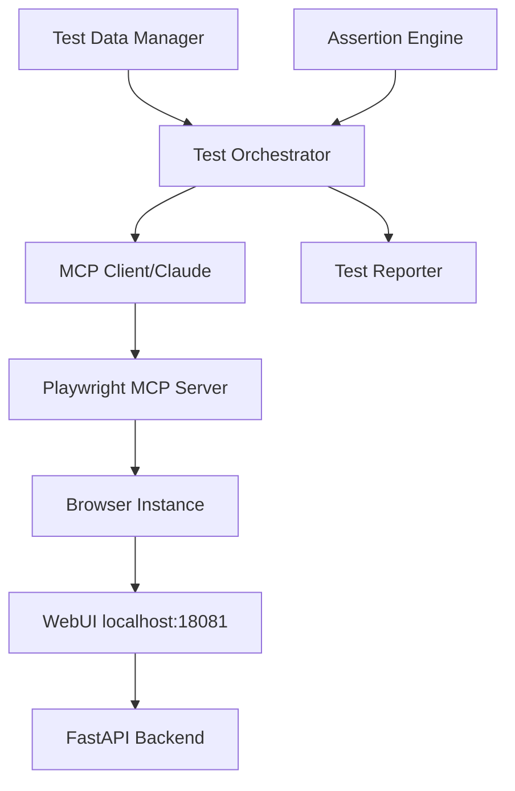
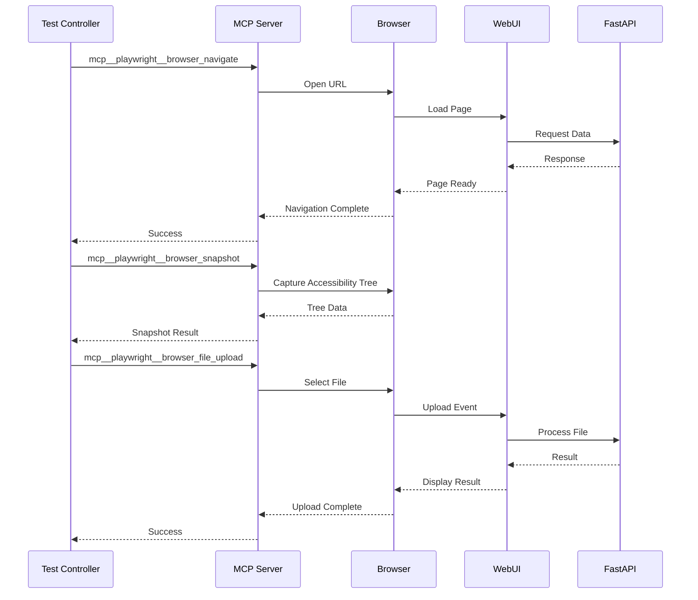
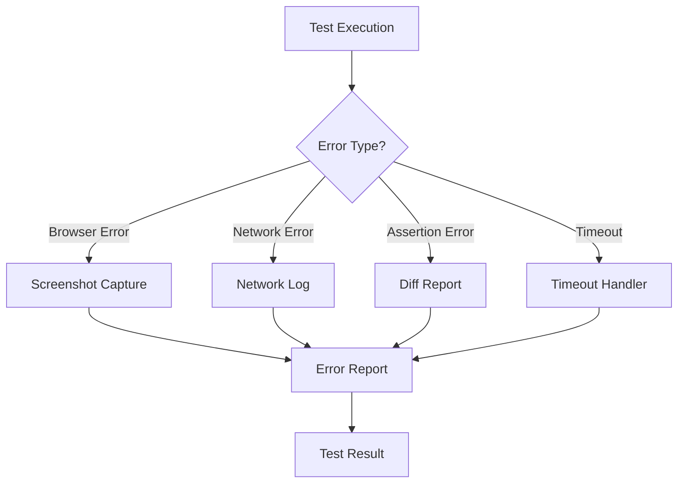

# Technical Design Document

## 概要

**目的**: この機能は、JSON Compare WebUIの包括的な自動テストシステムを、テスト自動化エンジニアとQAチームに提供します。

**ユーザー**: テスト自動化エンジニア、QAエンジニア、開発チームが、WebUIの動作検証、レグレッションテスト、CI/CDパイプラインでの品質保証に活用します。

**影響**: 現在の手動テストプロセスを自動化し、テスト実行時間を大幅に短縮します。Playwright MCPツールを活用することで、従来のPlaywrightテストよりも柔軟で保守性の高いテストシステムを実現します。

### ゴール
- Playwright MCPツールによる包括的なE2Eテスト環境の構築
- 既存のpytest-playwrightテストとの統合
- CI/CDパイプラインへの組み込み可能なテストスイート
- 視覚的なテスト結果レポートとスクリーンショット記録

### 非ゴール
- 既存のpytest-playwrightテストの完全な置き換え
- パフォーマンステストやロードテストの実装
- Seleniumなど他のテストフレームワークへの移行

## アーキテクチャ

### 既存アーキテクチャ分析

現在のテストアーキテクチャ：
- **テストフレームワーク**: pytest + pytest-asyncio + playwright
- **テストパターン**: Page Object Modelの部分採用
- **テストタイプ**: 単体テスト、統合テスト、E2Eテスト
- **技術的制約**: 非同期処理による待機条件の複雑さ

### ハイレベルアーキテクチャ



**アーキテクチャ統合**：
- 既存パターンの維持: pytest構造、フィクスチャシステム
- 新規コンポーネントの理由: MCPプロトコルによる柔軟な制御
- 技術スタック整合性: 既存のpytest環境と共存
- ステアリングコンプライアンス: structure.mdのテスト戦略に準拠

### 技術整合性

既存のテストスタックとの整合：
- **pytest統合**: MCPテストをpytestケースとしてラップ
- **非同期処理**: asyncioによるMCP通信の非同期処理
- **データ管理**: 既存のフィクスチャシステムを活用

**主要設計決定**：

**決定1: 軽量MCPラッパー実装**
- **コンテキスト**: Playwright MCPは導入済み、効率的な統合が必要
- **代替案**: フルラッパー実装、直接MCP呼び出し、既存Playwrightのみ
- **選択アプローチ**: 最小限の軽量ラッパーでMCPツールを統合
- **理由**: MCPツール導入済みのため、エラーハンドリングとテストコンテキスト管理のみ必要
- **トレードオフ**: 最小限の実装工数で最大の効果を実現

**決定2: ハイブリッドテスト戦略**
- **コンテキスト**: 既存テストを維持しつつ、新機能をMCPで実装
- **代替案**: 完全移行、並行実装、従来手法の継続
- **選択アプローチ**: 新規テストケースはMCP、既存テストは段階的移行
- **理由**: リスクを最小限に抑えつつ、新技術の利点を活用
- **トレードオフ**: 2つのテストパラダイムの共存による複雑さ

## システムフロー

### テスト実行フロー



### エラーハンドリングフロー



## コンポーネントとインターフェース

### テスト実行レイヤー

#### MCPTestExecutor

**責任と境界**
- **主要責任**: Playwright MCPツールを使用したテストの実行制御
- **ドメイン境界**: テスト実行ドメイン
- **データ所有権**: テスト実行状態、結果データ
- **トランザクション境界**: 個々のテストケース単位

**依存関係**
- **インバウンド**: TestRunner、TestScheduler
- **アウトバウンド**: PlaywrightMCPClient、AssertionEngine
- **外部**: Playwright MCPサーバー

**サービスインターフェース**
```typescript
interface MCPTestExecutor {
  initialize(): Promise<void>;
  executeTest(testCase: TestCase): Promise<TestResult>;
  cleanup(): Promise<void>;
  captureState(): Promise<TestState>;
}

interface TestCase {
  id: string;
  name: string;
  steps: TestStep[];
  assertions: Assertion[];
  timeout?: number;
}

interface TestResult {
  testId: string;
  status: 'passed' | 'failed' | 'skipped';
  duration: number;
  errors?: TestError[];
  screenshots?: Screenshot[];
}
```

### MCP通信レイヤー

#### PlaywrightMCPClient

**責任と境界**
- **主要責任**: MCPプロトコルによるPlaywrightツールの呼び出し
- **ドメイン境界**: MCP通信ドメイン
- **データ所有権**: MCP通信状態、レスポンスキャッシュ
- **トランザクション境界**: 個々のMCP呼び出し単位

**依存関係**
- **インバウンド**: MCPTestExecutor、InteractionRecorder
- **アウトバウンド**: MCPServer（プロトコル通信）
- **外部**: MCP仕様、Playwright MCPツール定義

**サービスインターフェース**
```typescript
interface PlaywrightMCPClient {
  // ナビゲーション
  navigate(url: string): Promise<NavigationResult>;
  navigateBack(): Promise<void>;

  // スナップショット
  captureSnapshot(): Promise<AccessibilitySnapshot>;
  takeScreenshot(options?: ScreenshotOptions): Promise<Screenshot>;

  // インタラクション
  click(element: ElementRef): Promise<void>;
  type(element: ElementRef, text: string, options?: TypeOptions): Promise<void>;
  uploadFile(paths: string[]): Promise<void>;

  // フォーム操作
  fillForm(fields: FormField[]): Promise<void>;
  selectOption(element: ElementRef, values: string[]): Promise<void>;

  // 監視
  getConsoleMessages(): Promise<ConsoleMessage[]>;
  getNetworkRequests(): Promise<NetworkRequest[]>;
}
```

### テストデータ管理レイヤー

#### TestDataManager

**責任と境界**
- **主要責任**: テストデータの生成、管理、クリーンアップ
- **ドメイン境界**: テストデータドメイン
- **データ所有権**: テストフィクスチャ、一時ファイル
- **トランザクション境界**: テストセッション単位

**サービスインターフェース**
```typescript
interface TestDataManager {
  generateJSONLFile(records: any[]): Promise<string>;
  createTempFile(content: string, extension: string): Promise<string>;
  cleanupTempFiles(): Promise<void>;
  getFixture(name: string): Promise<any>;
}
```

### アサーション・検証レイヤー

#### AssertionEngine

**責任と境界**
- **主要責任**: テスト結果の検証とアサーション実行
- **ドメイン境界**: 検証ドメイン
- **データ所有権**: アサーション結果、差分データ
- **トランザクション境界**: 個々のアサーション単位

**サービスインターフェース**
```typescript
interface AssertionEngine {
  assertVisible(snapshot: AccessibilitySnapshot, selector: string): void;
  assertText(snapshot: AccessibilitySnapshot, selector: string, expected: string): void;
  assertValue(actual: any, expected: any, message?: string): void;
  assertContains(collection: any[], item: any): void;
  generateDiff(actual: any, expected: any): DiffReport;
}
```

### レポート生成レイヤー

#### TestReporter

**責任と境界**
- **主要責任**: テスト結果のレポート生成と出力
- **ドメイン境界**: レポートドメイン
- **データ所有権**: レポートテンプレート、生成済みレポート
- **トランザクション境界**: テストスイート単位

**サービスインターフェース**
```typescript
interface TestReporter {
  startSuite(suite: TestSuite): void;
  reportTestResult(result: TestResult): void;
  generateReport(format: 'junit' | 'html' | 'json'): Promise<Report>;
  attachScreenshot(testId: string, screenshot: Screenshot): void;
  attachLog(testId: string, log: string): void;
}
```

## データモデル

### ドメインモデル

**コア概念**：
- **TestSuite**: テストケースのコレクション（集約ルート）
- **TestCase**: 個別のテストシナリオ（エンティティ）
- **TestStep**: テストケース内の実行ステップ（値オブジェクト）
- **TestResult**: テスト実行結果（エンティティ）

**ビジネスルール**：
- テストケースは必ず1つ以上のステップを持つ
- タイムアウトは設定値を超えてはならない
- スクリーンショットは失敗時に必須

### 論理データモデル

**構造定義**：
```typescript
// テストスイート
interface TestSuite {
  id: string;
  name: string;
  testCases: TestCase[];
  config: TestConfig;
  metadata: SuiteMetadata;
}

// テスト設定
interface TestConfig {
  baseUrl: string;
  timeout: number;
  retryCount: number;
  parallelism: number;
  screenshotOnFailure: boolean;
}

// MCPアクション
interface MCPAction {
  tool: string;
  parameters: Record<string, any>;
  expectedResult?: any;
  timeout?: number;
}

// テスト実行コンテキスト
interface TestContext {
  sessionId: string;
  browserContext: BrowserContext;
  currentPage?: PageContext;
  variables: Map<string, any>;
}
```

### 物理データモデル

**テスト結果ストレージ**：
```json
{
  "suiteId": "suite_001",
  "executionId": "exec_20250918_001",
  "startTime": "2025-09-18T20:00:00Z",
  "endTime": "2025-09-18T20:15:00Z",
  "results": [
    {
      "testId": "test_001",
      "name": "ファイルアップロードテスト",
      "status": "passed",
      "duration": 5234,
      "steps": [
        {
          "action": "navigate",
          "status": "completed",
          "duration": 1200
        }
      ],
      "artifacts": {
        "screenshots": ["screenshot_001.png"],
        "logs": ["console.log"]
      }
    }
  ]
}
```

## エラーハンドリング

### エラー戦略
MCPツールエラー、ブラウザエラー、アサーションエラーを区別し、適切なリカバリ処理を実行。

### エラーカテゴリと対応
**ユーザーエラー (4xx)**: 無効な入力 → 入力検証メッセージ表示; 認証エラー → 再認証ガイド
**システムエラー (5xx)**: MCP通信エラー → リトライ処理; タイムアウト → タイムアウト延長
**ビジネスロジックエラー (422)**: データ不整合 → データ修復提案; 状態エラー → 状態リセット

### 監視
- MCPツール呼び出しログ
- ブラウザコンソールエラー監視
- ネットワークエラー追跡
- テスト実行メトリクス収集

## テスト戦略

### ユニットテスト
- MCPTestExecutor: テストケース実行ロジック
- AssertionEngine: アサーション処理
- TestDataManager: データ生成・管理
- PlaywrightMCPClient: MCP通信処理

### 統合テスト
- MCP通信とブラウザ制御の統合
- テスト実行からレポート生成までの統合フロー
- 既存pytestテストとの相互運用性
- CI/CDパイプライン統合

### E2E/UIテスト
- ファイルアップロード完全フロー
- 2ファイル比較処理フロー
- LLMモード選択と実行フロー
- エラー処理とリカバリフロー
- マルチタブ操作フロー

### パフォーマンス
- 並列テスト実行時のスループット
- 大量テストケースの実行時間
- MCPサーバーとの通信オーバーヘッド
- スクリーンショット生成パフォーマンス

## セキュリティ考慮事項

### 認証とアクセス制御
- MCPサーバーへの接続認証
- テストデータの暗号化保存
- 機密情報のマスキング処理

### データ保護
- テストデータの一時ファイル暗号化
- スクリーンショット内の個人情報マスキング
- ログファイルの機密情報除去

### 脆弱性対策
- MCPプロトコルインジェクション防御
- ファイルアップロードサイズ制限
- タイムアウト設定による無限ループ防止