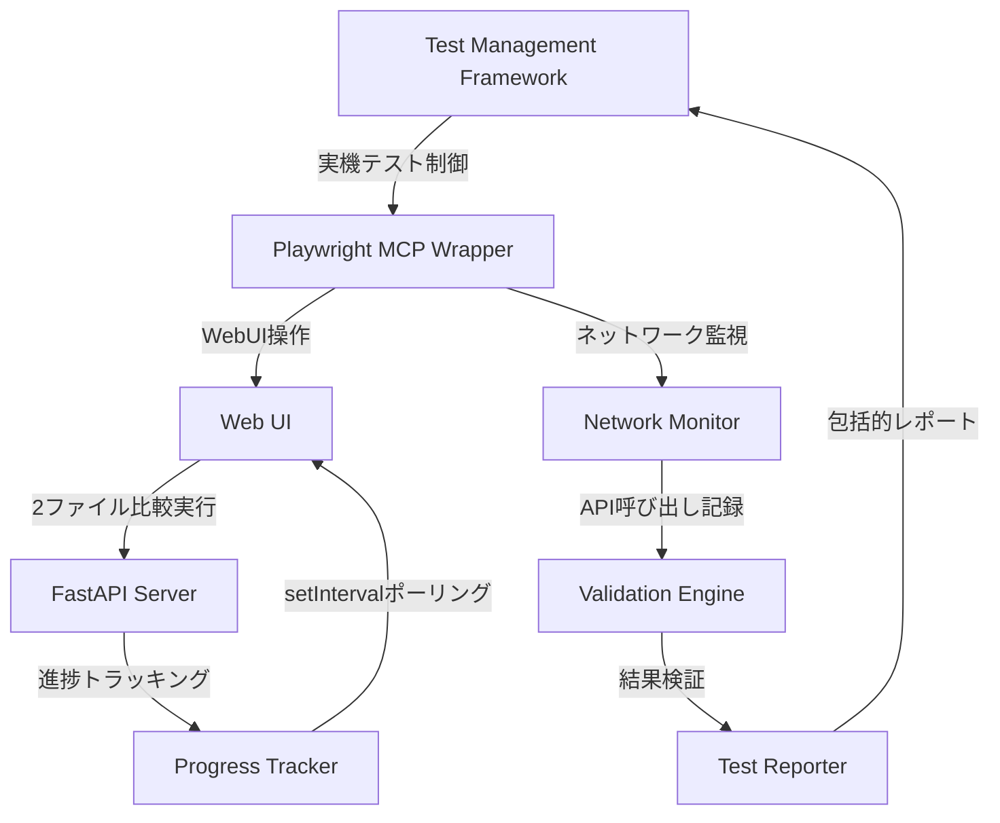
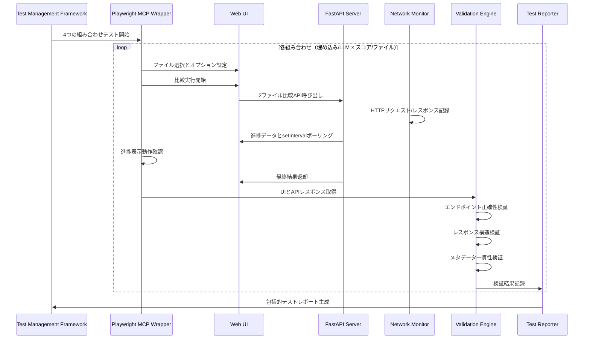

# Technical Design Document

## 概要

JSON Compare WebUIの進捗表示機能および2ファイル比較機能に対する包括的検証システムの設計です。現在実装済みのsetIntervalポーリング方式による進捗表示機能に加えて、2ファイル指定時の出力形式（スコア/ファイル）とLLM使用の有無による全組み合わせが正しいAPIエンドポイントを呼び出し、期待される結果を返すことをPlaywright MCPによる実機テストで検証します。

**目的**: 実装済み機能の品質保証と、2ファイル比較時のAPI呼び出し正確性を自動検証により担保する。
**ユーザー**: QAエンジニアおよびWebUIユーザーが主な対象。実装済み進捗表示機能の継続利用と、2ファイル比較の信頼性向上を提供する。
**影響**: 既存の進捗表示機能を保持しつつ、包括的テスト検証により品質保証レベルを向上させる。

### ゴール
- 実装済み進捗表示機能の動作確認と品質保証
- 2ファイル比較時のAPI呼び出し正確性の自動検証
- Playwright MCPによる実機テスト基盤の活用
- 4つの組み合わせ（埋め込み/LLM × スコア/ファイル）の包括的検証

### 非ゴール
- 既存進捗表示機能の機能変更や再実装
- 新しいテストフレームワークの導入
- パフォーマンス最適化や大規模データ処理対応

## アーキテクチャ

### 既存アーキテクチャの分析
現在のシステムは以下の構成で実装済み：
- FastAPIベースのWeb API (`src/api.py`) - 進捗トラッキングエンドポイント実装済み
- setIntervalポーリング方式によるWebUI進捗表示 - 完全実装済み
- 進捗追跡システム (`src/progress_tracker.py`) - 21.7KBの完全実装
- Playwright MCPフレームワーク - 12の専門化されたテストマネージャー統合済み
- 2ファイル比較APIエンドポイント (`/api/compare/dual`, `/api/compare/dual/llm`) - 実装済み

### ハイレベルアーキテクチャ



**アーキテクチャ統合**:
- 既存パターンの保持: FastAPIエンドポイント構造、setIntervalポーリング方式、Playwright MCPフレームワーク
- 新規コンポーネントの根拠: テスト検証エンジンは品質保証に必要、ネットワーク監視はAPI呼び出し正確性確認に必要
- 技術スタックとの整合: 既存のPlaywright MCP基盤を活用、FastAPIエンドポイント検証に最適化

### 技術整合性

**既存スタックとの統合**:
- Playwright MCPフレームワークの12の専門化されたテストマネージャーを活用
- 既存の軽量ラッパー (`mcp_wrapper.py`) を基盤として利用
- FastAPIの既存エンドポイント構造に準拠した検証設計

**新規依存関係**:
- 既存Playwright MCPフレームワーク内での拡張のため新規依存関係なし
- ネットワーク監視機能は既存 `console_network_monitor.py` を活用

### 主要な設計判断

**判断1: 既存Playwright MCPフレームワーク活用 vs 新規テストフレームワーク**
- **コンテキスト**: 2ファイル比較検証のためのテスト基盤が必要
- **選択したアプローチ**: 既存のPlaywright MCPフレームワーク活用
- **根拠**: 12の専門化されたテストマネージャーが既に統合済み、43テストケースで100%自動化実績あり
- **トレードオフ**: 新規フレームワークの柔軟性は失うが、実装コストと統合リスクを大幅削減

**判断2: リアルタイム検証 vs バッチ検証**
- **コンテキスト**: 2ファイル比較時のAPI呼び出しとレスポンス検証方法
- **選択したアプローチ**: リアルタイムネットワーク監視による即座検証
- **根拠**: 既存のネットワーク監視機能を活用し、実際のAPI呼び出しを即座に検証可能
- **トレードオフ**: バッチ処理による効率性は劣るが、実機テストでの正確性と即応性を確保

## システムフロー

### 2ファイル比較検証フロー



## コンポーネントとインターフェース

### テスト管理層

#### Test Management Framework
**責任と境界**
- **主要責任**: 2ファイル比較検証テストの全体制御と結果統合
- **ドメイン境界**: テスト実行制御ドメイン
- **データ所有**: テスト設定、実行状態、結果データ
- **トランザクション境界**: 各テストケース単位で独立

**依存関係**
- **インバウンド**: QAエンジニア、CI/CDシステム
- **アウトバウンド**: Playwright MCP Wrapper、Test Reporter
- **外部**: 既存Playwright MCPフレームワーク

**Service Interface**
```typescript
interface TestManagementFramework {
  executeComprehensiveTest(): Promise<TestExecutionResult>;
  validateDualFileComparison(
    mode: "embedding" | "llm",
    format: "score" | "file"
  ): Promise<ValidationResult>;
  generateTestReport(results: ValidationResult[]): TestReport;
}

interface TestExecutionResult {
  totalCombinations: 4;
  successfulCombinations: number;
  failedCombinations: number;
  executionTime: number;
  detailedResults: ValidationResult[];
}
```

#### Playwright MCP Integration Layer
**責任と境界**
- **主要責任**: 既存Playwright MCPフレームワークとの統合とWebUI操作制御
- **ドメイン境界**: UI自動化ドメイン
- **データ所有**: WebUI操作スクリプト、スクリーンショット、DOM状態

**Service Interface**
```typescript
interface PlaywrightMCPIntegration {
  setupDualFileComparison(
    file1: TestFile,
    file2: TestFile,
    options: ComparisonOptions
  ): Promise<void>;

  executeComparison(): Promise<void>;

  captureProgressDisplay(): Promise<ProgressDisplayData>;

  extractAPIResponse(): Promise<APIResponseData>;

  collectDebugInformation(): Promise<DebugData>;
}

interface ComparisonOptions {
  useLLM: boolean;
  outputFormat: "score" | "file";
  columnName?: string;
}
```

### 検証・監視層

#### Network Monitor Enhancement
**責任と境界**
- **主要責任**: 2ファイル比較時のAPI呼び出し監視と記録
- **ドメイン境界**: ネットワーク監視ドメイン
- **データ所有**: HTTPリクエスト/レスポンスデータ、タイミング情報

**Service Interface**
```typescript
interface NetworkMonitorEnhancement {
  startMonitoring(): void;

  stopMonitoring(): void;

  getRecordedRequests(): HTTPRequestRecord[];

  validateAPIEndpoint(
    expectedEndpoint: string,
    actualRequest: HTTPRequestRecord
  ): ValidationResult;
}

interface HTTPRequestRecord {
  url: string;
  method: string;
  headers: Record<string, string>;
  body: any;
  response: {
    status: number;
    headers: Record<string, string>;
    body: any;
  };
  timestamp: number;
  duration: number;
}
```

#### API Response Validation Engine
**責任と境界**
- **主要責任**: APIレスポンスの構造とメタデータの検証
- **ドメイン境界**: レスポンス検証ドメイン
- **データ所有**: 検証ルール、期待値定義、検証結果

**Service Interface**
```typescript
interface APIResponseValidationEngine {
  validateScoreResponse(
    response: any,
    expectedMethod: "embedding" | "llm"
  ): ValidationResult;

  validateFileResponse(
    response: any,
    expectedMethod: "embedding" | "llm"
  ): ValidationResult;

  validateMetadataConsistency(
    response: any,
    expectedMetadata: ExpectedMetadata
  ): ValidationResult;
}

interface ExpectedMetadata {
  calculation_method: "embedding" | "llm";
  source_files: {
    file1: string;
    file2: string;
  };
  column_compared: string;
}

interface ValidationResult {
  isValid: boolean;
  errors: ValidationError[];
  warnings: ValidationWarning[];
  details: Record<string, any>;
}
```

### レポート生成層

#### Test Reporter
**責任と境界**
- **主要責任**: 包括的テスト結果の集約とレポート生成
- **ドメイン境界**: レポート生成ドメイン
- **データ所有**: テスト結果データ、レポートテンプレート、出力形式

**Service Interface**
```typescript
interface TestReporter {
  generateComprehensiveReport(
    results: TestExecutionResult
  ): ComprehensiveTestReport;

  exportReport(
    report: ComprehensiveTestReport,
    format: "markdown" | "json" | "html"
  ): string;

  saveReport(
    report: ComprehensiveTestReport,
    filePath: string
  ): Promise<void>;
}

interface ComprehensiveTestReport {
  executionSummary: ExecutionSummary;
  combinationResults: CombinationResult[];
  performanceMetrics: PerformanceMetrics;
  errorAnalysis: ErrorAnalysis;
  recommendations: string[];
}
```

## データモデル

### ドメインモデル

**コア概念**:
- **TestExecution**: 一回の包括的テスト実行を表すエンティティ
- **CombinationTest**: 4つの組み合わせのうち1つのテストを表すエンティティ
- **APICallValidation**: API呼び出しの検証結果を表す値オブジェクト
- **ProgressDisplayValidation**: 進捗表示の検証結果を表す値オブジェクト

### 論理データモデル

**テスト実行データ構造**:
```typescript
interface TestExecutionData {
  executionId: string;
  startTime: Date;
  endTime?: Date;
  status: "running" | "completed" | "failed";
  combinations: CombinationTestData[];
  summary: ExecutionSummary;
}

interface CombinationTestData {
  combinationId: string;
  mode: "embedding" | "llm";
  format: "score" | "file";
  expectedEndpoint: string;
  actualAPICall?: HTTPRequestRecord;
  responseValidation?: ValidationResult;
  progressValidation?: ProgressValidationResult;
  uiValidation?: UIValidationResult;
  status: "pending" | "running" | "passed" | "failed";
  errors: string[];
  executionTime: number;
}
```

## エラーハンドリング

### エラー戦略
テスト検証のエラーは段階的にキャプチャし、詳細なデバッグ情報と共に報告する。

### エラーカテゴリと対応

**テスト実行エラー**:
- WebUI操作失敗 → スクリーンショット付きエラーレポート
- API呼び出し失敗 → ネットワークログと詳細エラー情報
- タイムアウト → 実行時間分析と推奨対策

**検証エラー**:
- エンドポイント不一致 → 期待値vs実際値の詳細比較
- レスポンス構造エラー → スキーマ差分とフィールド詳細
- メタデータ不整合 → フィールド別比較表

**システムエラー**:
- Playwright MCP接続失敗 → 環境設定チェックリスト
- ファイルアップロード失敗 → ファイル内容とサイズ検証

### モニタリング
- テスト実行成功率の追跡
- API呼び出し応答時間の監視
- エラーパターンの分析と対策提案

## テスト戦略

### ユニットテスト
- APIレスポンス検証エンジンの各メソッド
- ネットワーク監視機能の記録と解析
- テストレポート生成ロジック
- メタデータ一貫性チェック機能

### 統合テスト
- Playwright MCPとネットワーク監視の連携
- テスト管理フレームワークと検証エンジンの統合
- 4つの組み合わせの順次実行フロー
- レポート生成と保存機能

### E2E/実機テスト
- 実際のWebUIでの2ファイル比較操作
- setIntervalポーリングと進捗表示の連携確認
- エラーケース（LLM API障害等）のハンドリング
- 包括的レポートの自動生成と保存

### パフォーマンステスト
- 4つの組み合わせの連続実行時間
- 大容量ファイルでのテスト実行性能
- 複数テスト実行時のリソース使用量
- ネットワーク監視のオーバーヘッド測定

## 要件トレーサビリティ

| 要件 | 要件概要 | コンポーネント | インターフェース | フロー |
|------|----------|------------|------------|-----|
| 10.1-10.4 | 4つの組み合わせAPI検証 | Test Management Framework, Network Monitor | validateDualFileComparison | 2ファイル比較検証フロー |
| 10.5 | ネットワーク監視・記録 | Network Monitor Enhancement | getRecordedRequests | ネットワーク記録フロー |
| 10.6 | APIレスポンス検証 | API Response Validation Engine | validateScoreResponse, validateFileResponse | レスポンス検証フロー |
| 10.7 | 進捗表示統合検証 | Playwright MCP Integration | captureProgressDisplay | 進捗表示検証フロー |
| 10.8 | エラーハンドリング検証 | Error Handling Validator | validateErrorScenarios | エラーハンドリングフロー |
| 10.9 | UI/APIレスポンス整合性 | UI Consistency Validator | validateUIConsistency | 整合性検証フロー |
| 10.10-10.12 | 包括的レポート生成 | Test Reporter | generateComprehensiveReport | レポート生成フロー |