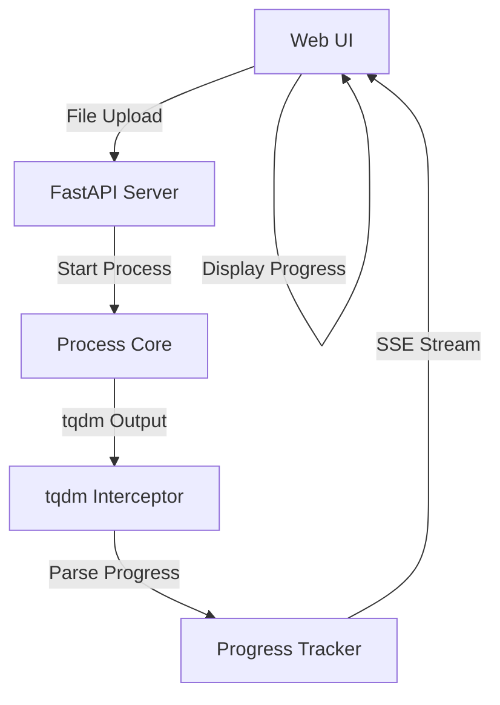
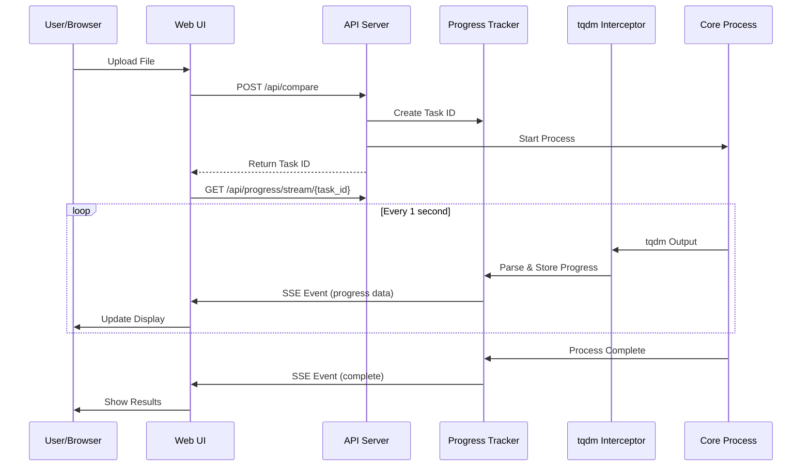

# Technical Design Document

## 概要
JSON Compare WebUIに処理進捗をリアルタイムで表示する機能を追加します。現在コンソールのtqdmプログレスバーで表示されている進捗情報をキャプチャし、WebUI上でビジュアルに表示します。Server-Sent Events (SSE) を使用してサーバーからクライアントへリアルタイムに進捗データをストリーミングし、処理済み件数、経過時間、推定残り時間を表示します。

**目的**: この機能はWebUIユーザーに処理の透明性を提供し、長時間処理の際の不安を解消します。
**ユーザー**: WebUIからファイルをアップロードして比較処理を実行するユーザーが主な対象です。
**影響**: 現在の同期的なレスポンス方式を非同期ストリーミング方式に拡張し、ユーザー体験を大幅に改善します。

### ゴール
- tqdm出力から進捗データを抽出してWebUIに配信
- リアルタイムでプログレスバーと時間情報を更新
- 処理速度から残り時間を推定して表示

### 非ゴール
- 複数の並列処理タスクの管理
- 過去の処理履歴の永続化
- バッチ処理のキューイング機能

## アーキテクチャ

### 既存アーキテクチャの分析
現在のシステムは以下の構成です：
- FastAPIベースのWeb API (`src/api.py`)
- tqdmによるコンソール進捗表示（`src/__main__.py`）
- 構造化ログシステム（`src/logger.py`）
- HTMLベースのシンプルなWeb UI（`/ui`エンドポイント）

### ハイレベルアーキテクチャ



**アーキテクチャ統合**:
- 既存パターンの保持: FastAPIのエンドポイント構成、ロギングシステム
- 新規コンポーネントの根拠: tqdmインターセプターは進捗データ抽出に必要、Progress TrackerはSSE配信に必要
- 技術スタックとの整合: FastAPIのSSE機能を活用、既存のロギング基盤を拡張
- ステアリング準拠: structure.mdで計画された`progress_tracker.py`モジュールを実装

### 技術整合性

**既存スタックとの統合**:
- FastAPIの組み込みSSEサポートを活用
- 既存のロギングシステムを拡張して進捗情報を記録
- tqdmの出力をリダイレクトして解析

**新規依存関係**:
- SSE実装のための`sse-starlette`（FastAPI互換）
- 進捗データのインメモリ管理用辞書構造

### 主要な設計判断

**判断1: SSE vs WebSocket**
- **コンテキスト**: サーバーからクライアントへの一方向データ配信が必要
- **選択したアプローチ**: Server-Sent Events (SSE)
- **根拠**: 実装がシンプルで、一方向通信に最適化されており、自動再接続機能を持つ
- **トレードオフ**: 双方向通信は不可能だが、進捗表示には不要

**判断2: tqdm出力のキャプチャ方法**
- **コンテキスト**: tqdmの進捗情報を取得する必要がある
- **選択したアプローチ**: StringIOによる出力リダイレクトと正規表現パース
- **根拠**: tqdmの内部APIに依存せず、安定した動作が期待できる
- **トレードオフ**: パフォーマンスオーバーヘッドがあるが、1秒更新なら問題ない

## システムフロー

### 処理開始から完了までのシーケンス



## コンポーネントとインターフェース

### バックエンド層

#### ProgressTracker (`src/progress_tracker.py`)

**責任と境界**
- **主要責任**: 処理タスクの進捗情報を管理し、SSE経由でクライアントに配信する
- **ドメイン境界**: 進捗トラッキングドメイン
- **データ所有**: タスクID、進捗データ（処理済み件数、全件数、開始時刻）
- **トランザクション境界**: 各タスク単位で独立

**依存関係**
- **インバウンド**: APIエンドポイント、tqdmインターセプター
- **アウトバウンド**: なし
- **外部**: sse-starlette（SSE実装）

**サービスインターフェース**
```python
from typing import Dict, Optional
from dataclasses import dataclass

@dataclass
class ProgressData:
    task_id: str
    total: int
    current: int
    percentage: float
    elapsed_time: float
    estimated_remaining: Optional[float]
    status: str  # "processing", "completed", "error"
    error_message: Optional[str]

class ProgressTracker:
    def create_task(self, total_items: int) -> str:
        """新規タスクを作成してタスクIDを返す"""
        pass

    def update_progress(self, task_id: str, current: int) -> None:
        """タスクの進捗を更新"""
        pass

    def get_progress(self, task_id: str) -> Optional[ProgressData]:
        """タスクの現在の進捗を取得"""
        pass

    def complete_task(self, task_id: str, success: bool = True) -> None:
        """タスクを完了/エラー状態にする"""
        pass

    async def stream_progress(self, task_id: str):
        """SSEでの進捗ストリーミング"""
        pass
```

- **事前条件**: タスクIDが存在すること
- **事後条件**: 進捗データが更新されること
- **不変条件**: current <= total

#### TqdmInterceptor (`src/progress_tracker.py` 内部)

**責任と境界**
- **主要責任**: tqdmの出力をキャプチャして進捗データを抽出
- **ドメイン境界**: ログキャプチャドメイン
- **データ所有**: tqdm出力バッファ

**サービスインターフェース**
```python
import io
from contextlib import contextmanager

class TqdmInterceptor:
    @contextmanager
    def capture_tqdm(self, task_id: str, progress_tracker: ProgressTracker):
        """tqdm出力をキャプチャしてProgressTrackerに送信"""
        pass

    def parse_tqdm_output(self, output: str) -> Dict[str, int]:
        """tqdm出力から進捗情報を抽出"""
        # Return: {"current": int, "total": int}
        pass
```

### APIエンドポイント層

#### 進捗ストリーミングAPI

**APIコントラクト**

| Method | Endpoint | Request | Response | Errors |
|--------|----------|---------|----------|--------|
| GET | /api/progress/stream/{task_id} | - | SSE Stream | 404 |
| GET | /api/progress/{task_id} | - | ProgressData | 404 |
| POST | /api/compare/async | CompareRequest + File | {"task_id": str} | 400, 500 |

**SSEイベント形式**
```typescript
interface ProgressEvent {
  event: "progress" | "complete" | "error";
  data: {
    task_id: string;
    current: number;
    total: number;
    percentage: number;
    elapsed_seconds: number;
    remaining_seconds?: number;
    status: string;
    error_message?: string;
  };
}
```

### フロントエンド層

#### ProgressDisplay （Web UI JavaScript）

**責任と境界**
- **主要責任**: SSEを受信して進捗UIを更新
- **ドメイン境界**: UIプレゼンテーション層
- **データ所有**: 表示用の進捗データキャッシュ

**インターフェース**
```javascript
class ProgressDisplay {
  constructor(containerId) {
    this.container = document.getElementById(containerId);
    this.eventSource = null;
  }

  startMonitoring(taskId) {
    // SSE接続を開始
  }

  updateDisplay(progressData) {
    // プログレスバー、時間、件数を更新
  }

  handleComplete(resultData) {
    // 完了表示と結果表示
  }

  handleError(errorData) {
    // エラー表示
  }
}
```

## データモデル

### ドメインモデル

**コア概念**:
- **ProcessTask**: 一つの比較処理タスクを表すエンティティ
- **ProgressSnapshot**: ある時点での進捗状態を表す値オブジェクト
- **TaskCompleted**: タスク完了を表すドメインイベント

### 論理データモデル

**タスク管理構造**:
```python
# インメモリデータストア
tasks: Dict[str, TaskData] = {}

@dataclass
class TaskData:
    task_id: str
    created_at: datetime
    total_items: int
    current_items: int
    start_time: float
    last_update: float
    status: str
    result: Optional[Dict]
    error: Optional[str]
```

## エラーハンドリング

### エラー戦略
進捗トラッキングのエラーは処理自体を停止させず、ユーザーに適切なフィードバックを提供します。

### エラーカテゴリと対応

**ユーザーエラー (4xx)**:
- 無効なタスクID → 404エラーと再試行ガイダンス
- ファイルサイズ超過 → 413エラーとファイル分割提案

**システムエラー (5xx)**:
- SSE接続失敗 → 自動再接続（最大5回）
- メモリ不足 → 処理中断と部分結果の提供

**ビジネスロジックエラー (422)**:
- 処理タイムアウト → タイムアウトメッセージと再試行オプション
- 不正なJSONL形式 → 修復試行とエラー箇所の表示

### モニタリング
- SSE接続数の監視
- タスクのメモリ使用量追跡
- エラー率とタイムアウト頻度の記録

## テスト戦略

### ユニットテスト
- ProgressTrackerのタスク管理ロジック
- TqdmInterceptorの出力パース
- 進捗データの計算ロジック
- 推定残り時間の算出

### 統合テスト
- APIエンドポイントとProgressTrackerの連携
- SSEストリーミングの動作確認
- tqdm出力のキャプチャと配信フロー

### E2E/UIテスト
- ファイルアップロードから進捗表示までのフロー
- SSE接続と再接続の動作
- プログレスバーとタイマーの更新
- エラー時のUIフィードバック

### パフォーマンステスト
- 大規模ファイル（100万行）での進捗更新頻度
- 複数クライアント同時接続時のSSE配信
- メモリ使用量とガベージコレクション